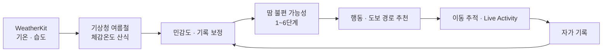
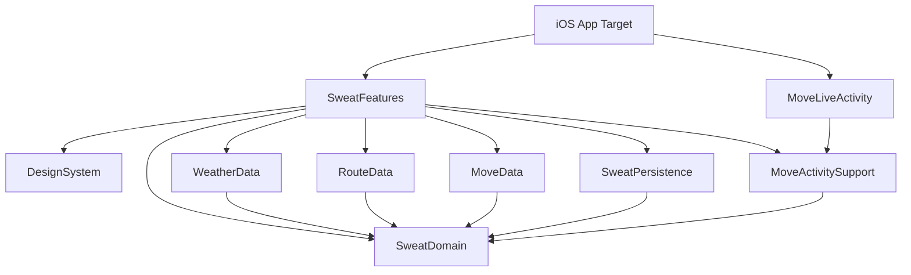

<div align="center">
  

  <h1>ADA Challenge 5 · 땀 관리 날씨 앱</h1>
  <p>
    WeatherKit의 날씨를 <strong>6단계 땀 불편 가능성</strong>으로 번역하고,<br>
    현재 단계에 맞는 도보 이동과 자가 기록을 연결하는 iOS 앱
  </p>
  <p>Apple Developer Academy @ POSTECH · Challenge 5 · Norton</p>
</div>

> 이 앱은 땀의 양을 예측하지 않습니다. 체감온도와 개인 설정을 바탕으로
> 땀을 느끼거나 땀 때문에 불편할 **가능성**을 안내합니다.

## 프로젝트 소개

기온이나 습도만으로는 외출할 때 얼마나 불편할지 바로 판단하기 어렵습니다.
이 프로젝트는 날씨 정보를 행동으로 옮길 수 있도록 다음 흐름을 하나의 경험으로 연결합니다.



## 주요 기능

| 기능 | 설명 |
|---|---|
| 개인화 온보딩 | 땀 민감도, 주 이동수단, 야외 이동 시간과 위치·알림 사용 여부를 설정합니다. |
| 오늘의 땀 단계 | 현재 위치의 기온·습도로 체감온도를 계산하고 개인 보정을 더해 1~6단계로 보여줍니다. |
| 시간별·주간 예보 | 시간별·7일 예보를 땀 단계, 기온, 습도와 함께 제공합니다. |
| 단계별 설명과 행동 | 단계가 높아진 이유와 옷차림·수분·휴식 등 상황별 행동을 안내합니다. |
| 도보 경로 탐색 | MapKit으로 장소를 검색하고 도보 경로 후보, 예상 시간, 경로 선을 보여줍니다. |
| 이동 중 안내 | 백그라운드 위치로 진행률을 계산하고 Live Activity와 로컬 알림으로 상태를 이어갑니다. |
| 자가 기록과 보정 | 실제 불편 점수와 원인을 기록하고, 충분한 표본이 쌓이면 다음 예측의 개인 보정값을 갱신합니다. |
| 접근성 | VoiceOver용 정보 라벨, Dynamic Type 재배치, 44pt 이상 터치 영역과 색 외 보조 표현을 적용합니다. |

## 핵심 설계

### 1. 날씨를 땀의 양이 아닌 불편 가능성으로 해석합니다

WeatherKit에서 기온과 상대습도를 받아 기상청의 여름철 체감온도 산식으로 체감온도를
직접 계산합니다. WeatherKit이 제공하는 `apparentTemperature`는 단계 기준과 산식이
달라 사용하지 않습니다.

체감온도에 사용자의 민감도와 기록 기반 보정값을 반영한 뒤 1~6단계로 구간화합니다.
단계 경계값은 `SweatStage.boundaries` 한 곳에서만 관리하며, 현재 값은 확정된 의학 기준이
아닌 제품 설계안입니다.

- 습도는 체감온도 산식에 이미 반영되므로 단계 계산에서 다시 더하지 않습니다.
- 풍속은 단계를 바꾸지 않고 설명과 추천의 강도에만 사용합니다.
- 높은 단계에서는 완곡한 표현보다 온열질환 안전 안내를 우선합니다.

### 2. 기록이 실제로 다음 예측을 바꿉니다

자가 기록은 단순한 히스토리가 아니라 `CalibrationEngine`의 입력입니다. 유효한 고습도
기록이 5건 이상 모이면 예측 단계와 실제 점수의 차이를 학습률 `0.25`로 반영합니다.
보정값은 급격한 변화를 막기 위해 `-1.5...1.5℃` 범위로 제한하고, 변경 이유를 사용자에게
함께 보여줍니다.

### 3. 경로 데이터가 없을 때 값을 만들어내지 않습니다

도보 경로 후보는 예상 시간과 실외 노출을 함께 평가하도록 설계되어 있습니다. 땀 단계가
높을수록 실외 노출의 비용이 커집니다. 다만 현재 실제 실내·지하·그늘 데이터 공급자는
연결 전이므로, 분석 데이터가 없는 지역에서는 비율을 `0%`로 표시하지 않고 해당 정보를
숨긴 채 예상 시간으로 경로를 비교합니다.

### 4. 네트워크 실패에도 가능한 한 마지막 정보를 제공합니다

`WeatherRepository`가 조회, 캐시, 재시도와 타임아웃을 한곳에서 관리합니다.

- 10분 이내 캐시는 네트워크 없이 바로 사용
- 요청 실패 시 1시간 이내 마지막 성공값 사용
- 요청당 15초 타임아웃과 1회 재시도
- 오래된 값을 보여줄 때 `n분 전` 상태 표시

## 기술 스택

| 영역 | 기술 |
|---|---|
| UI | SwiftUI |
| 상태 관리 | Observation (`@Observable`) |
| 언어·동시성 | Swift 6.0, Strict Concurrency `complete` |
| 날씨 | WeatherKit |
| 위치·경로 | Core Location, MapKit |
| 이동 중 표시 | ActivityKit, WidgetKit, UserNotifications |
| 데이터 저장 | SwiftData, UserDefaults |
| 차트 | Swift Charts |
| 테스트 | Swift Testing |
| 모듈화 | Local Swift Package Manager |

## 아키텍처

화면, 순수 도메인, Apple 프레임워크 연동과 저장소를 로컬 패키지로 분리했습니다.
`SweatDomain`은 `Foundation` 외에 의존성을 두지 않아 권한·네트워크·시뮬레이터 없이
핵심 계산을 테스트할 수 있습니다.



| 모듈 | 책임 |
|---|---|
| `SweatFeatures` | 온보딩, 홈, 지도·경로, 이동 중, 마이·기록 화면과 Store |
| `SweatDomain` | 체감온도, 6단계, 개인 보정, 경로 정렬, 이동 진행 계산 |
| `WeatherData` | WeatherKit 어댑터, 출처 정보, 캐시·재시도·실패 처리 |
| `RouteData` | 장소 검색, MapKit 도보 경로, 노출 분석 인터페이스 |
| `MoveData` | 백그라운드 위치 추적과 이동 알림 |
| `MoveActivitySupport` | 앱과 Live Activity 확장이 공유하는 상태와 갱신 정책 |
| `SweatPersistence` | 사용자 설정, 자가 기록, 진행 중 이동 상태 저장 |
| `DesignSystem` | Figma 색상·타이포그래피·레이아웃 토큰과 공통 컴포넌트 |

## 프로젝트 구조

```text
.
├── ADA_Challenge5_Norton/
│   ├── ADA_Challenge5_Norton/       # 앱 진입점, 설정, Asset
│   ├── MoveLiveActivity/            # Live Activity 확장
│   ├── Packages/                    # 도메인·데이터·기능 로컬 패키지
│   └── ADA_Challenge5_Norton.xcodeproj
├── docs/
│   ├── specs/                       # 기능별 spec과 task
│   ├── architecture.md              # 기술 설계와 의사결정
│   ├── rules.md                     # 제품·계산·코드 규칙
│   └── release-readiness.md         # TestFlight 전 검증 목록
├── Scripts/                         # 디자인 토큰 린트, 앱 아이콘 생성
└── README.md
```

## 개발 환경

| 항목 | 값 |
|---|---|
| Xcode | 26.x |
| Swift 언어 모드 | 6.0 |
| Swift tools version | 6.2 |
| 최소 지원 버전 | iOS 26.5 |
| 지원 기기 | iPhone |
| 화면 방향 | Portrait |

### 실행하기

```bash
git clone https://github.com/nansis4457/ADA_Challenge5_Norton.git
cd ADA_Challenge5_Norton
open ADA_Challenge5_Norton/ADA_Challenge5_Norton.xcodeproj
```

Xcode에서 `ADA_Challenge5_Norton` 스킴과 iPhone 시뮬레이터를 선택해 실행합니다.
실제 WeatherKit 데이터를 사용하려면 앱 타깃의 Signing Team과 WeatherKit capability가
유효해야 합니다. 별도의 기상청 API 키나 `Secrets.xcconfig`는 필요하지 않습니다.

CLI 빌드는 다음 명령으로 확인할 수 있습니다.

```bash
xcodebuild \
  -project ADA_Challenge5_Norton/ADA_Challenge5_Norton.xcodeproj \
  -scheme ADA_Challenge5_Norton \
  -destination 'generic/platform=iOS Simulator' \
  build
```

## 테스트와 정적 검사

테스트 타깃이 있는 7개 로컬 패키지를 각각 검증합니다.

```bash
for package in \
  SweatDomain WeatherData RouteData MoveData \
  MoveActivitySupport SweatPersistence SweatFeatures
do
  swift test --package-path "ADA_Challenge5_Norton/Packages/$package"
done
```

뷰에서 색상과 글꼴 리터럴을 직접 사용하지 않았는지는 별도 린트로 확인합니다.

```bash
./Scripts/lint-tokens.sh
```

## 현재 구현 상태

| 영역 | 상태 | 비고 |
|---|---|---|
| 파운데이션·디자인 시스템 | **Implemented** | Swift 6 전환, 토큰, 공통 컴포넌트, 도메인 엔진 |
| 온보딩 | **Implemented** | 개인 설정과 위치·알림 권한 흐름 |
| 홈·단계 상세 | **Implemented** | WeatherKit, 6단계, 시간별·주간 예보, 출처 표기 |
| 지도·도보 경로 | **In Progress** | MapKit 1차 구현 완료, 실제 실내·지하·그늘 데이터 연결 전 |
| 이동 추적·Live Activity | **In Progress** | 자동 검증 완료, 백그라운드·잠금 화면·배터리 실기기 검증 대기 |
| 마이·자가 기록·개인 보정 | **Implemented** | 당일 기록, 최근 기록 차트, 보정 리포트 |

### 출시 전 남은 작업

- 실제 실내·지하·그늘 및 공식 무더위쉼터 데이터 공급자 선정과 연결
- 위치 권한 거부, 오프라인, 경로 없음 상태의 실기기 최종 검증
- 백그라운드 위치, 잠금 화면, Dynamic Island와 배터리 사용량 실기기 검증
- 사용자에게 표시할 앱 이름과 App Store Connect 설정 확정
- TestFlight 업로드와 내부 테스터 검증

## 개발 방식과 문서

이 프로젝트는 기능마다 `spec.md → tasks.md → 구현 → 검증` 순서로 진행하는
Spec-Driven Development 방식을 사용합니다.

| 문서 | 내용 |
|---|---|
| [`docs/README.md`](docs/README.md) | 문서 인덱스와 작업 흐름 |
| [`docs/rules.md`](docs/rules.md) | UX Writing, 계산, 구조, 접근성 규칙 |
| [`docs/architecture.md`](docs/architecture.md) | 프레임워크 선택, 데이터 흐름, 기술적 의사결정 |
| [`docs/design-source.md`](docs/design-source.md) | Figma 화면과 코드 매핑 |
| [`docs/specs/README.md`](docs/specs/README.md) | 기능 스펙 로드맵 |
| [`docs/release-readiness.md`](docs/release-readiness.md) | TestFlight 전 자동·실기기 검증 목록 |
| [`땀_날씨앱_구간화_UI_멘트_개발가이드.md`](땀_날씨앱_구간화_UI_멘트_개발가이드.md) | 단계 구간과 UX Writing의 도메인 원본 |

## 디자인

구현 기준은 Figma `Challenge5` 파일의 `③ App UI` 페이지에 있는 12개 화면입니다.

[Figma에서 디자인 보기](https://www.figma.com/design/QKHhjWJNfvj1zcwThW29rz/Challenge5?node-id=30-24)
